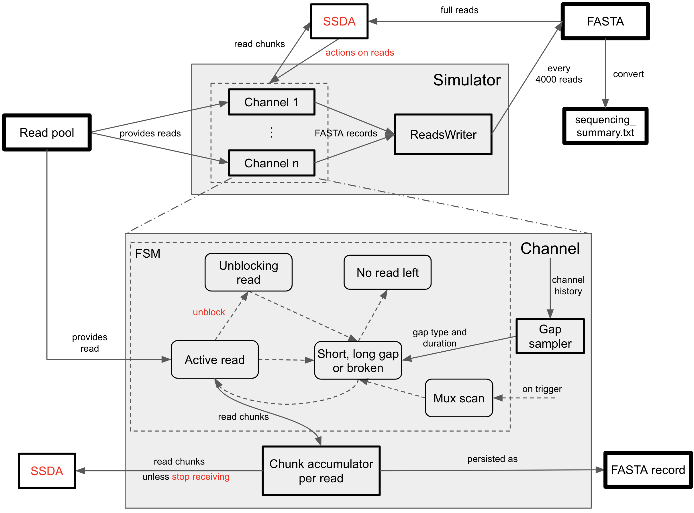
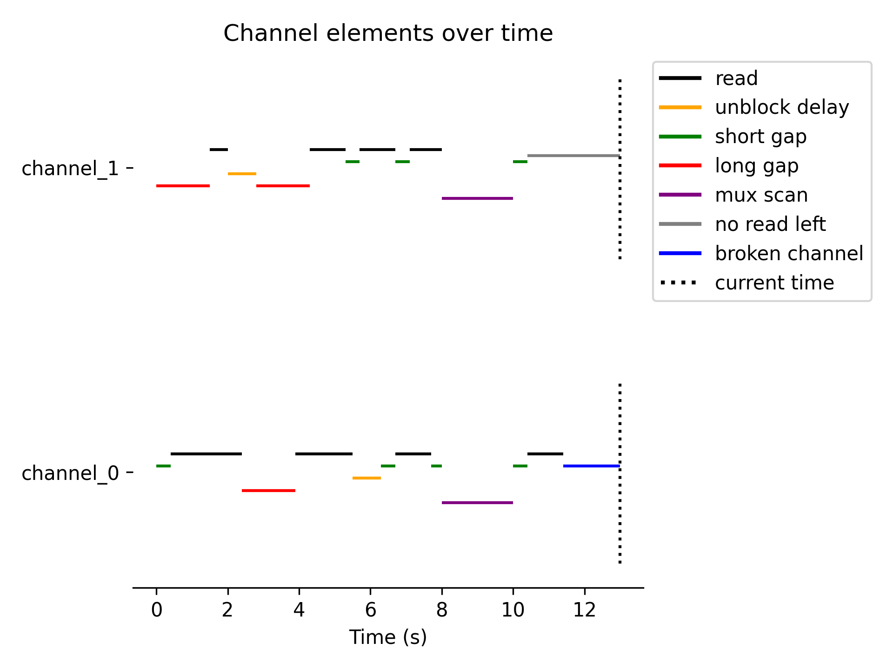
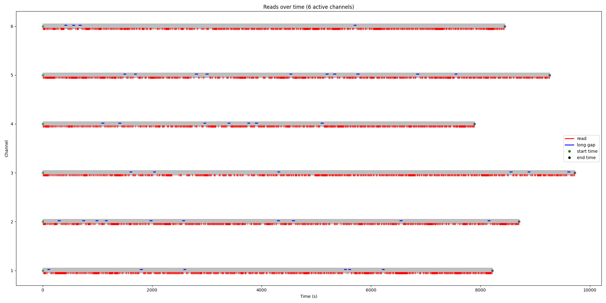

# SimReadUntil

[](../../actions/workflows/run_tox.yml)
[](../../actions/workflows/build_docker.yml)
[](../../actions/workflows/build_doc.yml)
<!-- [](../../actions/workflows/publish_pypi.yml) -->

This repository provides a simulator for an ONT device controlled by the ReadUntil API either directly or via gRPC, and can be accelerated (e.g. factor 10 with 512 channels). It takes full-length reads as input, plays them back with suitable gaps in between, and responds to ReadUntil actions.
The code is well-tested with `pytest` and an example usecase combining the simulator with ReadFish and NanoSim is provided.
Access the documentation [here](https://ratschlab.github.io/sim_read_until/).

A video for the CLI interface of the simulator (as described in [usecases](usecases/README.md)) is available here: [CLI interface Youtube](https://youtu.be/8GDTD4Memes)
See below for an [overview](#overview).

## Quick Start

Clone the repository, install the virtual environment and run the usecase, as explained below.

### Installation and Setup

We have tested the code with python3.10 and python3.8 on Linux and Mac OS X, so try to use it:
```{bash}
# create a shared directory:
mkdir ~/ont_project_all
cd ~/ont_project_all

git clone --depth 1 git@github.com:ratschlab/sim_read_until.git ont_project
# the NanoSim repository (integrated as a submodule here) is quite large (2Gb) due to pre-computed models, so we omit it here
# if you want it, do: git clone --recurse-submodules git@github.com:ratschlab/sim_read_until.git ont_project

# conda deactivate # if you have a conda environment activated, including base env
python3.10 -m venv ont_project_venv
source ~/ont_project_all/ont_project_venv/bin/activate
pip install --upgrade pip
pip install ont_project/
pip install --upgrade seaborn
```

Take a look at the directory [usecase](usecases/) to run some example usecases.

If the installation fails due to dependency issues, you can alternatively run it as a Docker image that comes with the dependencies and runs Jupyter lab:
```{bash}
# to update the Docker image if a new one was published
# note: it may not always be up-to-date with the main branch, check the release date online
docker pull ghcr.io/ratschlab/sim_read_until:main_dev

cd ~/ont_project_all
./ont_project/start_docker_container.sh
# to see the options
# ./ont_project/start_docker_container.sh -h
```
Several Docker containers can run in parallel, provided you modify the port and container name via the options `-n` and `-p`.

**Note**: Conda is not officially supported, but you can set up your environment with:
```{bash}
conda create -y -n ont_project_venv python=3.10 pip
```
Some scripts activate the virtual environment, so you have to change it to `conda activate ont_project_venv`.

## Overview

<!--  -->


The simulator consists of a set of channels that request reads from a read pool which is created from a set of full *basecalled* reads, coming from NanoSim or a real run. 
Each channel is a finite-state machine (FSM). A channel starts with a short or long gap, which is followed by a read, and then alternates. 
When a read is in-progress, its *basecalled* chunks can be requested to inform a selective sequencing algorithm (SSD) to make a decision about the read via the ReadUntil API. When a read is set to `stop_receiving`, it keeps sequencing, but no more chunks are returned from it. When a read is `unblocked`, a delay to unblock a read is inserted. 
After this, a new gap is requested. The type and length of gap are requested from a gap sampler that is given the channel history as input, including the number of reads, number of basepairs, number of rejections. This allows to build realistic simulators. We provide several variants of it, including replication of an existing run.

The channel can be interrupted by a mux scan which immediately stops the element in-progress. Only if it is a long gap, the long gap continues after the mux scan has completed.
The channel can also go into a `ChannelBroken` state, after which the channel does not produce any new reads.
When no reads are left, the channel goes into the sink state `NoReadsLeft`.

As reads have finished, they are written in batches to a FASTA file. The FASTA file headers are sufficient to produce a `sequencing_summary.txt` with the essential columns, see the conversion script `simfasta_to_seqsum`. The usecase shows how to analyze the selective sequencing performance given the `sequencing_summary.txt`.

By default, the simulator runs in asynchronous mode which forwards the channels at regular time intervals, progressively making the read chunks available and writing the reads as they have finished.
The simulator also has a synchronous mode where the channels need to be forwarded manually, useful for debugging and writing new gap extraction methods (only supported directly and not via gRPC), see [replicate_run](usecases/replicate_run.py).

An example visualization with random actions issued over time is shown below.
<!--  -->


You can also take a look at the [README](src/simreaduntil/simulator/README.md) of the simulator itself.

Parameters can be extracted from a real sequencing summary. A run can be replicated (similarly to UNCALLED) or we learn the distributional parameters as shown here:
<!--  -->


### Repository Structure

The repository contains the following directories (as submodules):

- `src/simreaduntil`:
  - `simulator`: code for simulating an ONT device
  - `shared_utils`: shared utilities across the ONT project
  - `seqsum_tools`: to handle a sequence summary file, e.g. for later parameter extraction (for sampling gaps)
  - `usecase_helpers`: helper methods to support the experiments
- `usecases`: use case that combines the simulator with `ReadFish` (and optionally `NanoSim`)
- `external`: modified external projects:
  - `ont_readfish`: ReadFish adapted to work with the ONT simulator; installed as a package with `pip` to avoid changing the import statements in ReadFish
  - `ont_nanosim`: NanoSim with bug fixes with respect to seeding and refactoring (in `src/simulator.py`) as well as extra command line options, e.g. no flanking regions, skipping the error profile (quite big)
- `tests`: tests to run with pytest
- `runs`: for local runs; in `.gitignore`
- `apidocs`: location for API docs; in `.gitignore`

## Comparison with UNCALLED

We tried comparing with UNCALLED, but it didn't work due to a segmentation fault without any useful error message, see [uncalled_comparison](uncalled_comparison.md) for details.
According to the authors, the UNCALLED simulator is superseeded by the recent tool Icarust, which is a tool that addresses a similar setting as we do.

## Developer Notes

See [DeveloperNotes.md](DeveloperNotes) for details.
